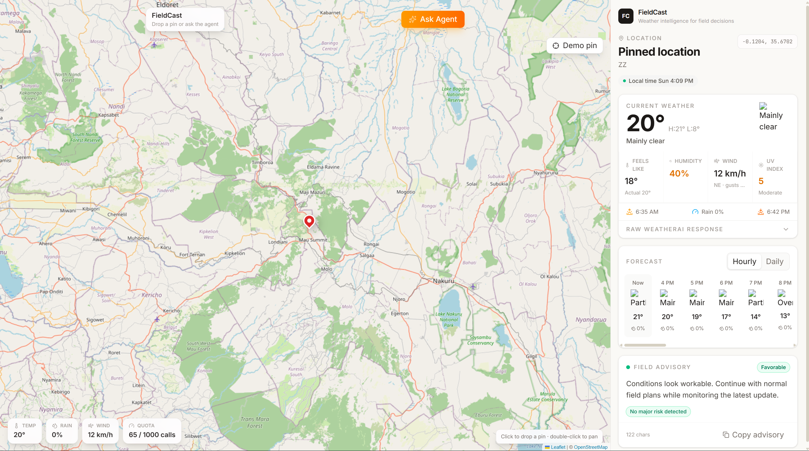
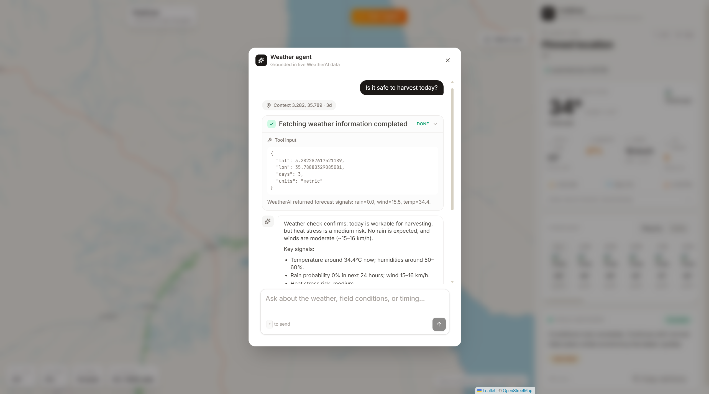

# FieldCast

FieldCast is an interactive field intelligence map that turns raw weather API responses into operational decisions.

**🌐 Live demo:** [https://weather-nu-lovat.vercel.app/](https://weather-nu-lovat.vercel.app/)

Users can click anywhere on the map, fetch a WeatherAI forecast through a FastAPI backend, inspect the raw response, copy a concise advisory, and ask a streaming tool-calling agent for natural-language advice.

---

## 📸 Screenshots

### Map + panel layout



### Agent interface with a sample interaction



---

## 🏗️ Architecture

```text
┌─────────────────────────────────────────────────────────────┐
│                        User (Browser)                         │
│  ┌────────────────────┐            ┌──────────────────────┐  │
│  │  Interactive map   │            │  Weather panels      │  │
│  │  (Leaflet)         │            │  (Next.js / React)   │  │
│  └────────┬───────────┘            └──────────┬───────────┘  │
└───────────┼────────────────────────────────────┼─────────────┘
            │                                    │
            │     HTTP / Server-Sent Events        │
            └──────────────┬─────────────────────┘
                           │
              ┌────────────▼────────────┐
              │    FastAPI backend      │
              │    (Python / uv)        │
              │                         │
              │  • /api/weather         │
              │  • /api/usage           │
              │  • /api/chat            │
              │  • /api/chat/stream     │
              └────────────┬────────────┘
                           │
              ┌────────────▼────────────┐
              │      WeatherAI API      │
              │   https://api.weather-ai.co │
              │                         │
              │  • /v1/weather          │
              │  • /v1/usage            │
              └─────────────────────────┘

LangChain agent layer
┌─────────────────────────────────────┐
│  ChatOpenAI (gpt-5-nano / gpt-5)   │
│  └─► Tool: get_weather (WeatherAI)   │
│       └─► Streaming SSE response     │
└─────────────────────────────────────┘
```

---

## ✨ Features

- **Two-panel experience**: full interactive Leaflet map on the left, weather intelligence on the right.
- **Weather intelligence hierarchy**: location summary, current conditions, hourly/daily forecast timeline, and a field advisory.
- **Streaming weather agent**: a chat-style interface that calls WeatherAI live and streams tokens, tool calls, and reasoning.
- **Copy-ready advisory**: a single-field advisory with one-tap copy.
- **FastAPI backend**: keeps the WeatherAI API key private and powers the streaming agent.
- **Raw WeatherAI JSON inspector**: a collapsed panel for transparent API review.
- **Usage visibility**: surfaces API usage and quota limits from the WeatherAI `/v1/usage` response in the UI's floating metrics indicator.

---

## 🛠️ Stack

- **Frontend**: Next.js 16, React 19, Tailwind CSS v4, Leaflet, TanStack Query
- **Backend**: FastAPI, uv, httpx, pydantic-settings, LangChain
- **AI**: OpenAI chat model (GPT-5 or newer)
- **API**: WeatherAI `/v1/weather` and `/v1/usage`

---

## 🚀 Setup Instructions

### Prerequisites

- Python 3.12+ and `uv`
- Node.js + pnpm
- A WeatherAI API key
- An OpenAI API key

### 1. Clone and configure

```bash
git clone https://github.com/kodalegit/weather.git
cd weather

# Backend environment
cp backend/.env.example backend/.env
# Edit backend/.env with your keys

# Frontend environment
cp frontend/.env.example frontend/.env.local
# Edit frontend/.env.local if your backend is not on localhost
```

Example `backend/.env`:

```bash
WEATHERAI_API_KEY=your_weatherai_api_key
WEATHERAI_BASE_URL=https://api.weather-ai.co
FRONTEND_ORIGIN=http://localhost:3000
OPENAI_API_KEY=your_openai_api_key
OPENAI_CHAT_MODEL=gpt-5-nano
```

Example `frontend/.env.local`:

```bash
NEXT_PUBLIC_API_BASE_URL=http://localhost:8000
```

### 2. Start the backend

```bash
cd backend
uv sync
uv run fastapi dev main.py
```

The API runs at `http://localhost:8000`.

### 3. Start the frontend

```bash
cd frontend
pnpm install
pnpm dev
```

The app runs at `http://localhost:3000`.

---

## 🔌 API Endpoints Used

### Backend routes (FieldCast API)

| Method | Endpoint           | Description                                               |
| ------ | ------------------ | --------------------------------------------------------- |
| GET    | `/health`          | Health check and API key configuration status             |
| GET    | `/api/weather`     | Fetch forecast for a lat/lon and return advisory + meta   |
| GET    | `/api/usage`       | Proxy WeatherAI account usage / quota                     |
| POST   | `/api/chat`        | Non-streaming field advisory for a message                |
| POST   | `/api/chat/stream` | Streaming agent response (SSE) with tool calls and tokens |

### External APIs consumed

| Service       | Endpoint                         | Purpose                                  |
| ------------- | -------------------------------- | ---------------------------------------- |
| WeatherAI     | `GET /v1/weather`                | Forecast, current conditions, AI summary |
| WeatherAI     | `GET /v1/usage`                  | Usage quota and rate-limit information   |
| OpenAI        | Chat Completions (via LangChain) | Tool-calling streaming agent reasoning   |
| OpenStreetMap | Tile server                      | Map tiles for the Leaflet map            |

---

## 🧪 Verification

```bash
cd backend
uv run python -m py_compile main.py

cd ../frontend
pnpm lint
pnpm build
```

---

## 🌐 Deployment Notes

Deploy the backend as a FastAPI service on Railway or Render:

```bash
fastapi run main.py
```

Set backend environment variables:

- `WEATHERAI_API_KEY`
- `WEATHERAI_BASE_URL=https://api.weather-ai.co`
- `FRONTEND_ORIGIN=https://your-frontend-domain`
- `OPENAI_API_KEY`
- `OPENAI_CHAT_MODEL`

Deploy the frontend on Railway, Netlify, or Vercel and set:

- `NEXT_PUBLIC_API_BASE_URL=https://your-backend-domain`

---

## 📁 Project Structure

```text
.
├── backend/
│   ├── app/
│   │   ├── __init__.py
│   │   ├── config.py          # pydantic-settings + env vars
│   │   ├── schemas.py         # Pydantic request models
│   │   ├── locations.py       # Place name → coordinate lookup
│   │   ├── weather_service.py # WeatherAI HTTP client
│   │   ├── weather_parser.py  # Response parsing + advisory scoring
│   │   └── agent.py           # LangChain streaming agent + SSE
│   ├── main.py                # FastAPI app & route wiring
│   ├── pyproject.toml
│   └── .env.example
├── frontend/
│   ├── src/
│   │   ├── app/               # Next.js app router
│   │   ├── components/        # Map, panels, agent UI
│   │   └── lib/               # Weather parsing + helpers
│   ├── package.json
│   └── .env.example
├── README.md
└── TODO.md
```

---

## 📝 Project Framing

The Free WeatherAI plan is enough for the core demo. Real SMS sending is not included in the MVP because WeatherAI's live SMS/USSD delivery is a Scale-plan capability, so FieldCast presents a production-shaped advisory that can be copied and wired to live delivery once approved.
